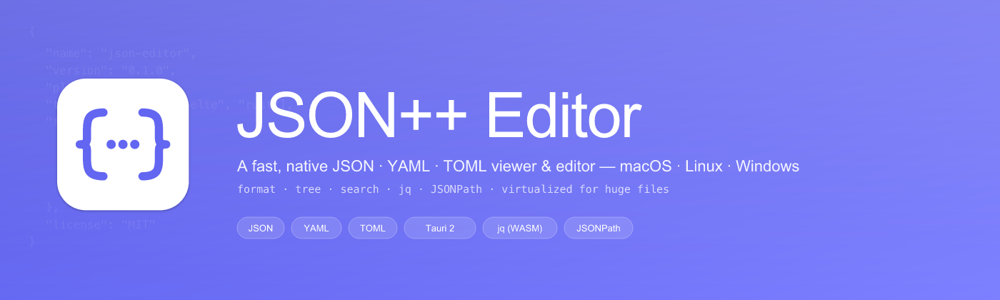

<p align="center">
  
</p>

<p align="center">
  <a href="https://github.com/shakedzy/json-editor/releases"></a>
  
  
  
  
  
  
</p>

A fast, native **JSON · YAML · TOML** viewer & editor — in the spirit of apps like OK JSON.
Open a file (or paste a blob), query with **jq** or **JSONPath**, browse huge documents with a virtualized tree.

> Ships for macOS, Linux, and Windows — one Tauri codebase. macOS is the primary target and is what I actually use day-to-day; the Linux / Windows builds come out of CI but haven't had the same polish pass.

---

## Features

- **Three formats, one app** — JSON, YAML, and TOML. Each tab remembers its source format; open a `.yaml`, save a `.yaml`.
- **Editor** — CodeMirror 6 with per-language syntax highlighting, folding, live lint, `⌘F` find.
- **Tree view** — virtualized; stays at 60 FPS on 100 k+ nodes. Click any node to copy its JSONPath.
- **Query bar** — **jq** (real `jq`, compiled to WASM) or **JSONPath**. Works on YAML/TOML too: jq sees the parsed value as JSON. `⌘↩` to run, `↑`/`↓` for history.
- **Format / Minify / Validate** — `⌘⇧F` / `⌘⇧M` / `⌘⇧V`. Auto-format on paste. (Minify is JSON-only — YAML/TOML don't have a meaningful minimized form.)
- **File associations** — right-click a `.json`, `.yaml`, `.yml`, or `.toml` file and JSON++ Editor shows up in the system "Open With" menu (macOS Finder, Linux file managers, Windows Explorer).
- **Multi-tab** — `⌘T` / `⌘W` / `⌘1…9` (or `Ctrl` on Linux/Windows), drag-drop files, recent files.
- **Native menubar on macOS**, standard window menus elsewhere. All the expected shortcuts.
- **Theme** — light / dark / follows system. Font size & indent configurable.
- **Tiny** — ~4 MB DMG, ~5 MB AppImage / MSI.

## Install

Grab the build for your platform from the [latest release](https://github.com/shakedzy/json-editor/releases/latest):

| OS | File |
| --- | --- |
| macOS (Apple Silicon) | `JSON++ Editor_*_aarch64.dmg` |
| macOS (Intel) | `JSON++ Editor_*_x64.dmg` |
| Linux | `JSON++ Editor_*_amd64.AppImage` or `.deb` |
| Windows | `JSON++ Editor_*_x64.msi` or the NSIS `.exe` |

**macOS**: open the DMG, drag **JSON++ Editor** onto **Applications**. First launch: because the app is ad-hoc signed, Gatekeeper will complain — right-click in Applications → **Open** → **Open**. After that, launch normally.

**Linux**: `chmod +x JSON++\ Editor_*.AppImage && ./JSON++\ Editor_*.AppImage`, or `sudo dpkg -i json++-editor_*.deb`.

**Windows**: run the `.msi` or `.exe`. SmartScreen may warn on unsigned builds — "More info" → "Run anyway".

Signed & notarized macOS builds + code-signed Windows binaries are on the roadmap.

## Keyboard shortcuts

| Action | Shortcut |
| --- | --- |
| New tab | `⌘T` |
| Open file | `⌘O` |
| Save / Save As | `⌘S` / `⌘⇧S` |
| Close tab | `⌘W` |
| Jump to tab N | `⌘1`…`⌘9` |
| Format | `⌘⇧F` |
| Minify | `⌘⇧M` |
| Validate | `⌘⇧V` |
| Find in editor | `⌘F` |
| Run query | `⌘↩` |
| Toggle tree pane | `⌘⇧T` |
| Toggle query bar | `⌘⇧Q` |
| Preferences | `⌘,` |

## Develop

Prerequisites: Node 20+, Rust (stable) via [rustup](https://rustup.rs), Xcode Command Line Tools (`xcode-select --install`).

```bash
git clone https://github.com/shakedzy/json-editor.git
cd json-editor
npm install
npm run tauri dev
```

## Build

```bash
# One-shot: images + tauri build + DMG patch
npm run dist:mac

# Or step-by-step:
npm run images              # regenerate PNGs from SVG sources
npm run tauri build         # build .app + .dmg in src-tauri/target/release/bundle/
npm run patch:dmg           # strip .VolumeIcon.icns + tidy .background (macOS only)
```

`patch:dmg` removes Tauri's default `.VolumeIcon.icns` and moves the `.background` folder inside the window bounds, so users with "Show Hidden Files" (`⌘⇧.`) turned on don't see stray icons when they scroll the installer window.

The DMG is ~4 MB and ad-hoc signed — Gatekeeper will flag it on first run until the user does right-click → Open.
For notarized builds, set `APPLE_ID`, `APPLE_PASSWORD` (app-specific), and `APPLE_TEAM_ID` in your environment before `tauri build`.

## Architecture

```
src/                    # Svelte 5 frontend
  routes/+page.svelte   # App shell wiring
  lib/
    components/         # Editor, TreeView, QueryBar, TabBar, StatusBar, LangPicker, ...
    stores/             # tabs · settings · recents (runes-based)
    lang/               # per-format parse/format + CodeMirror extension:
                        #   json.ts · yaml.ts · toml.ts · index.ts (dispatch)
    json/               # JSONPath helpers (format-agnostic)
    query/              # jq (WASM) + JSONPath wrappers
    util/               # shortcuts · theme
src-tauri/              # Rust backend
  src/
    lib.rs              # Plugin setup, menu wiring, RunEvent::Opened → open-file
    menu.rs             # Native macOS menubar
    commands.rs         # File IO commands
  tauri.conf.json       # Bundle / DMG config, fileAssociations for json/yaml/yml/toml
assets/                 # SVG sources for icon, banner, DMG background
scripts/
  build-images.mjs      # Rasterizes SVGs to PNGs
  patch-dmg.mjs         # Strips .VolumeIcon.icns, tucks bg PNG into app bundle
```

## Tech

- [Tauri 2](https://v2.tauri.app) — Rust-backed desktop runtime, small binaries.
- [Svelte 5](https://svelte.dev) (runes) + [SvelteKit](https://kit.svelte.dev) in SPA mode.
- [CodeMirror 6](https://codemirror.net) — with [`@codemirror/lang-json`](https://www.npmjs.com/package/@codemirror/lang-json), [`@codemirror/lang-yaml`](https://www.npmjs.com/package/@codemirror/lang-yaml), and `@codemirror/legacy-modes/mode/toml`.
- [`yaml`](https://eemeli.org/yaml/) (eemeli/yaml) — YAML 1.2 parser with line/col errors.
- [`smol-toml`](https://github.com/squirrelchat/smol-toml) — modern TOML parser.
- [`jq-wasm`](https://github.com/owenthereal/jq-wasm) — real `jq` compiled to WASM; runs against the parsed value, so YAML/TOML documents query just like JSON.
- [`jsonpath-plus`](https://www.npmjs.com/package/jsonpath-plus) — JSONPath queries.
- [`@tanstack/svelte-virtual`](https://tanstack.com/virtual) — virtualized tree rendering.
- [Tailwind CSS v4](https://tailwindcss.com).

## Roadmap

- [ ] Cross-format conversion (JSON ↔ YAML ↔ TOML) with warnings at lossy edges.
- [ ] Inline tree editing (rename keys, change values, delete / insert nodes).
- [ ] JSON Schema validation & autocomplete.
- [ ] Diff view between two documents.
- [ ] JSON5 / JSONC input.
- [ ] Apple Developer ID signing + notarization in CI.
- [ ] Publishing releases to [JFrog Fly](https://docs.fly.jfrog.com) for private distribution.

## License

MIT — see [LICENSE](./LICENSE).
